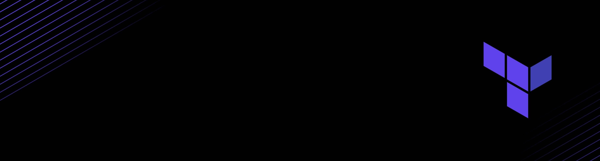

## Hi Ciber Frends 👋

_Bienvenidos !!! esto son resumenes de como aprender herremientas de Ciberseguridad._

## 📺 Mis Videos Recomendados sobre Principios SOLID

<table align="center" border="0" cellpadding="0" cellspacing="0">
  <tr>
    <!-- Título Video 1 -->
    <th align="center" width="31%" style="border: none; padding-bottom: 5px;">Responsabilidad Única (SRP)</th>
    <th width="2%"></th> <!-- Espaciador -->
    <!-- Título Video 2 -->
    <th align="center" width="31%" style="border: none; padding-bottom: 5px;">Abierto / Cerrado (OCP)</th>
    <th width="2%"></th> <!-- Espaciador -->
    <!-- Título Video 3 -->
    <th align="center" width="31%" style="border: none; padding-bottom: 5px;">Sustitución de Liskov (LSP)</th>
  </tr>
  <tr>
    <!-- Video 1 -->
    <td align="center" style="border: none;">
      
    </td>
    <td></td> <!-- Espaciador -->
    <!-- Video 2 -->
    <td align="center" style="border: none;">
      
    </td>
    <td></td> <!-- Espaciador -->
    <!-- Video 3 -->
    <td align="center" style="border: none;">
      
    </td>
  </tr>
</table>

<!-- BEGIN YOUTUBE-CARDS -->

[")](https://www.youtube.com/watch?v=0p_eQGKFY3I)

<!-- END YOUTUBE-CARDS -->

<!--

-->
<!--
**aleduram/aleduram** is a ✨ _special_ ✨ repository because its `README.md` (this file) appears on your GitHub profile.

Here are some ideas to get you started:

- 🔭 I’m currently working on ...
- 🌱 I’m currently learning ...
- 👯 I’m looking to collaborate on ...
- 🤔 I’m looking for help with ...
- 💬 Ask me about ...
- 📫 How to reach me: ...
- 😄 Pronouns: ...
- ⚡ Fun fact: ...
-->
